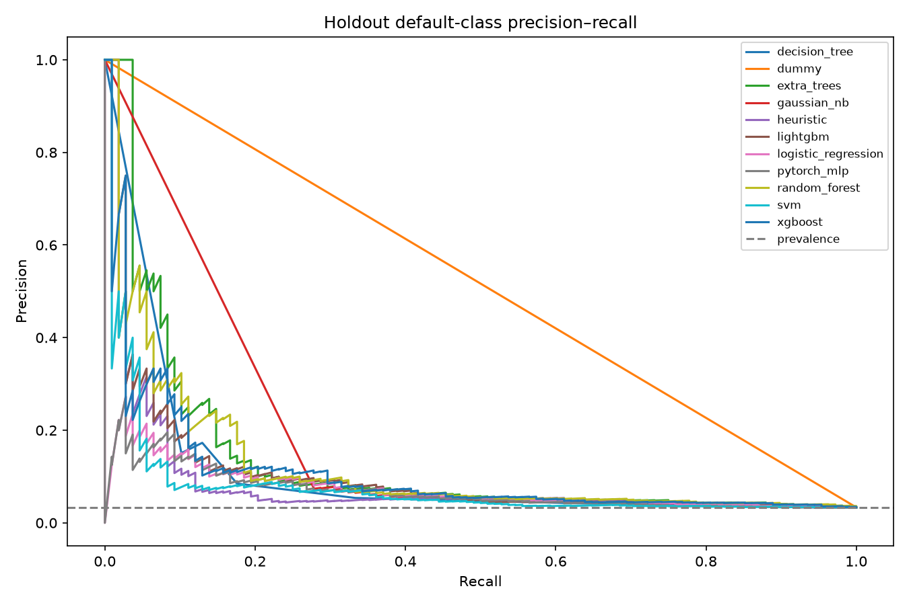
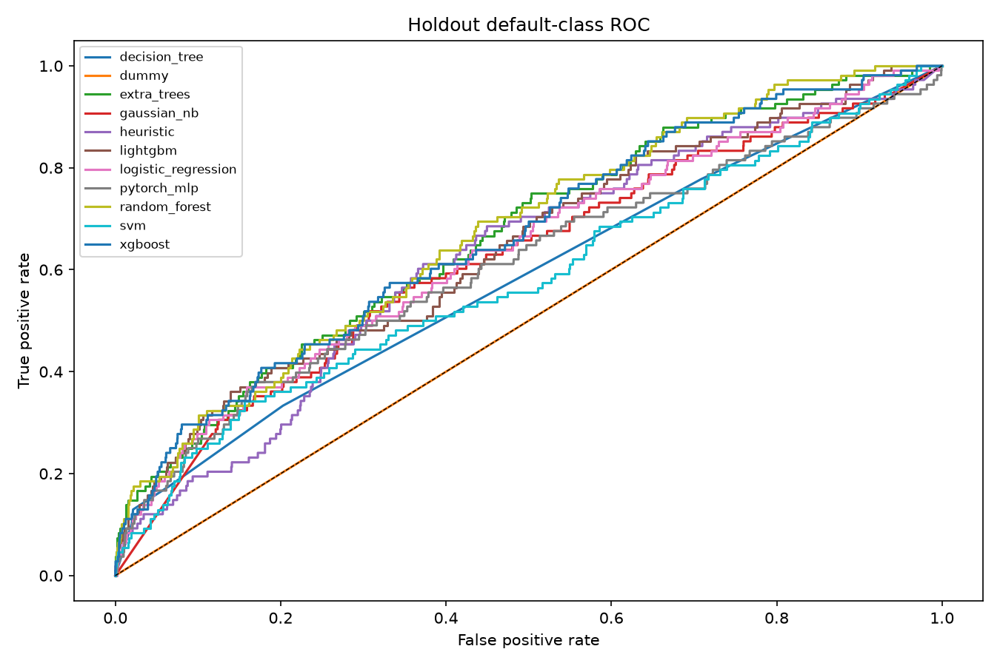
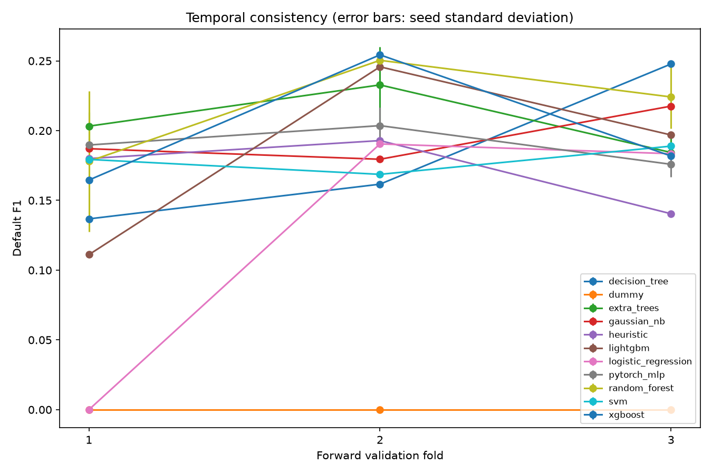
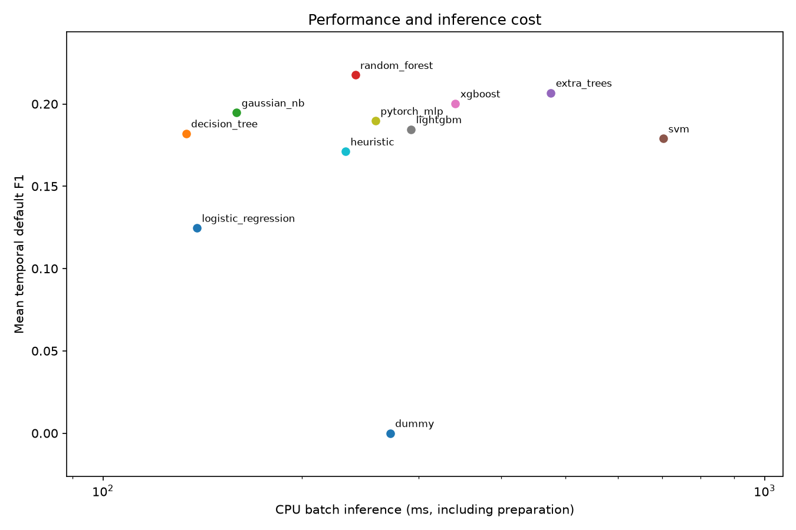
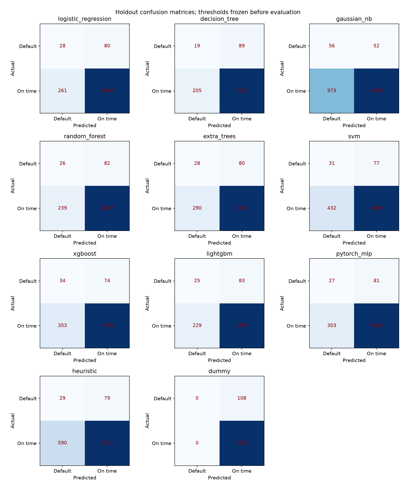

# Model comparison benchmark

Selected by temporal validation: **random_forest**. Default is `Pago_atiempo=0`. The newest 30% is evaluated after selection.

Training device: `cpu`; Python `3.12.14`. GPU validation on `192.168.1.137` is separate.

## Temporal validation

| model | mean_f1 | temporal_f1_std | seed_f1_std | cpu_batch_ms | artifact_bytes |
| --- | --- | --- | --- | --- | --- |
| logistic_regression | 0.1247 | 0.0882 | 0.0000 | 138.7095 | 55171 |
| decision_tree | 0.1821 | 0.0476 | 0.0000 | 133.6219 | 53827 |
| gaussian_nb | 0.1947 | 0.0165 | 0.0000 | 159.2986 | 57523 |
| random_forest | 0.2175 | 0.0299 | 0.0176 | 240.7191 | 770515 |
| extra_trees | 0.2068 | 0.0199 | 0.0078 | 475.4693 | 764755 |
| svm | 0.1790 | 0.0083 | 0.0000 | 703.3220 | 1378851 |
| xgboost | 0.2002 | 0.0389 | 0.0000 | 341.0780 | 197075 |
| lightgbm | 0.1846 | 0.0557 | 0.0000 | 292.2610 | 192835 |
| pytorch_mlp | 0.1897 | 0.0113 | 0.0069 | 258.2839 | 87843 |
| heuristic | 0.1711 | 0.0223 | 0.0000 | 232.6812 | 328835 |
| dummy | 0.0000 | 0.0000 | 0.0000 | 271.8458 | 52099 |

Within 0.01 F1 of the leader, prefer lower temporal variation, then seed variation, CPU latency, and artifact size. Heuristic/dummy are references and retain their original prediction rules.

## Frozen holdout

| model | accuracy | default_precision | default_recall | default_f1 | average_precision | roc_auc | recall_at_review_budget |
| --- | --- | --- | --- | --- | --- | --- | --- |
| logistic_regression | 0.8944 | 0.0969 | 0.2593 | 0.1411 | 0.0742 | 0.6358 | 0.3704 |
| decision_tree | 0.9090 | 0.0848 | 0.1759 | 0.1145 | 0.0562 | 0.5828 | 0.3333 |
| gaussian_nb | 0.6826 | 0.0544 | 0.5185 | 0.0985 | 0.0555 | 0.6202 | 0.3611 |
| random_forest | 0.9006 | 0.0981 | 0.2407 | 0.1394 | 0.1200 | 0.6734 | 0.3796 |
| extra_trees | 0.8854 | 0.0881 | 0.2593 | 0.1315 | 0.1329 | 0.6671 | 0.4074 |
| svm | 0.8424 | 0.0670 | 0.2870 | 0.1086 | 0.0773 | 0.5827 | 0.3611 |
| xgboost | 0.8678 | 0.0879 | 0.3148 | 0.1374 | 0.1055 | 0.6634 | 0.4074 |
| lightgbm | 0.9034 | 0.0984 | 0.2315 | 0.1381 | 0.1041 | 0.6436 | 0.4074 |
| pytorch_mlp | 0.8811 | 0.0818 | 0.2500 | 0.1233 | 0.0702 | 0.6084 | 0.3796 |
| heuristic | 0.7928 | 0.0468 | 0.2685 | 0.0798 | 0.0858 | 0.6241 | 0.2778 |
| dummy | 0.9666 | 0.0000 | 0.0000 | 0.0000 | 0.0334 | 0.5000 | 0.1944 |

## Selected configuration

```json
{
  "model": "random_forest",
  "parameters": {
    "class_weight": null,
    "max_depth": 6,
    "min_samples_leaf": 10,
    "n_estimators": 150
  },
  "threshold": 0.14287507114631004,
  "rule": "within tolerance of best mean F1; temporal std, seed std, CPU batch ms, bytes, name ascending",
  "f1_tolerance": 0.01
}
```

## Comparative graphs











## Reproducibility and limits

Dataset SHA-256: `48e34610b823055a5f4e7a107142e25b08ba40920848eab1a68ff6396eb26927`. Seeds: `[42, 43, 44]`. Platform: `Linux-6.12.0-211.50.1.el10_2.x86_64-x86_64-with-glibc2.39`.

| Package | Version |
| --- | --- |
| numpy | 2.5.2 |
| pandas | 3.0.5 |
| scikit-learn | 1.9.0 |
| torch | 2.13.0+cpu |
| xgboost | 3.4.1 |
| lightgbm | 4.7.0 |
| joblib | 1.5.3 |
| matplotlib | 3.11.1 |

The holdout was previously examined during EDA and baseline work; it is not a fresh external validation set. Feature availability at decision time and outcome maturity remain assumptions. CPU timings include preparation and are local measurements, not deployment SLAs. See [workflow documentation](../model_training.md) for the protocol, configuration, and regeneration commands.
